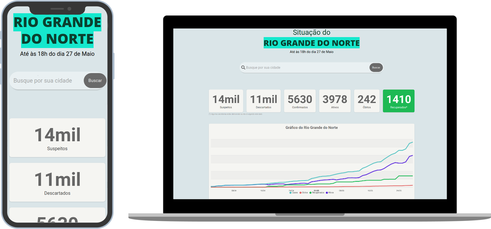

<p align="center">
    
</p>
    <h1 align="center">COVID-RN</h1>

<h4 align="center">
  🔎🦠 Real-time coronavirus case tracker in Rio Grande do Norte
</h4>
<p align="center">
  

  
  
  <a href="https://github.com/KZTN/COVID-RN/commits/master">
    
  </a>

  <a href="https://github.com/KZTN/COVID-RN/issues">
    
  </a>

  
</p>
<p align="center">
  
</p>


## ⚠️ Warning
<b> 🔥 the project's SIR model is intended to be developed until 1th July. For more information, check out the <a href="#Workflow"> Workflow </a> and <a href="https://github.com/KZTN/COVID-RN/issues/5"> Issue </ a > this milestone to know the progress of the project. </b>
> Requests for specific dates have been implemented and are released for use and consultation, the related documentation has also been updated.

> Documentations have been unified, see <a href="#-Documentation">Documentation</a>

## 💻 Project

COVID-RN is a project that aims to track coronavirus cases across the territory of Rio Grande do Norte, reporting unique data for both the state and each city.

## 🤔 Reason / features
Due to the lack of the state does not have an API on the incidence of coronavirus cases and little dynamics in the publication of newsletters. The project has the scope to offer:
<ul>
   <li>A free access API REST   database for research and consultation</li>
    <li>An interface that makes the generated data available to the customer</li>
    <li>Graphs and maps focusing on cases in state</li>
</ul>

## 🔖 Layout

Based on the design of the epidemiological bulletins launched by SESAP-RN, the project followed the same model as the basis for the data structure. Subsequently gaining responsiveness for different screens, ensuring accessibility to different types of users with their respective desktop desktop and mobile 📱 devices.

## 💽 Datasource 

- [Secretaria de Saúde Pública do Rio Grande do Norte](http://www.saude.rn.gov.br/)

## 🔌 Base url

All calls must use the base url:
```
https://covid-rn-server.herokuapp.com
```
The API is using the Cors package, this allows access from any Interface (frontend), as long as it is directed to the appropriate port.
> Use [documentation](https://insomnia-documenter-covidrn-6fgddqztj.now.sh/) for more information on how to use the API correctly

## Starting...
These instructions will provide a copy of the project running on your local machine for development and testing purposes.

### Prerequisites
What you need to install the software:

```
node v12.x
yarn 1.22.4
npm 6.14.4
git
```
> For a better experience in the test environment with the API REST server, it is recommended to use the [insomnia](https://insomnia.rest/).

### Installing the project🚀
Cloning the project:

```
git clone https://github.com/KZTN/COVID-RN.git
```

Go to the project folder:

```
cd COVID-RN
```

Create an .env file at the root of the project and add the following lines:

```bash
REACT_APP_GOOGLE_KEY= YOUR_GOOGLE_API_HERE
REACT_APP_API_URL= https://covid-rn-server.herokuapp.com/api/v2
```
> To get your own google API go to https://console.cloud.google.com/

Getting project dependencies:

```bash
yarn install
```

Run the project:

```bash
yarn start
```


Visit http://localhost:3000 with your browser to see the result. 🎉

## 📄 Documentation 

<a href="https://covid-rn-documentation.now.sh/" target="_blank">Unified Version</a>


## How to contribute

- Fork this project
- Create a branch with your feature: `git checkout -b minha-feature`;
- Commit your changes: `git commit -m 'feat: Minha nova feature'`;
- Push to your branch: `git push origin minha-feature`.

After the merge of your pull request is done, you can delete your branch.

## Workflow

- [x] Create a REST API database
- [x] Create a web application for the project
- [x] Frontend and backend integration
- [x] Create responsive interface
- [x] Create graphs with database
- [x] Make maps with database
- [x] Deploy the application
- [x] API 2.0
- [x] API queries by specific date
- [ ] Develop an SIR epidemiological model in the project
- [ ] Generate access, query, error and debug statistics (on going...)
- [ ] Generate infected maps by date
- [x] Generate automatic service status reports
- [ ] Revision, refactoring and optimization of the entire project (on going...)
- [x] Create graphs with isolation rates
- [ ] Dictionary of cities, usability improvements, map navigation improvements
- [ ] and more...

## :memo: License

This project is under the MIT license. See the archive [LICENSE](LICENSE.md) for more details.

## 🤝 Help the project 

<a href="https://opencollective.com/covid-rn/donate" target="_blank">
  
</a>


## Authors

<table align="center">
  <tr >
    <td align="center"><a href="https://github.com/KZTN"><br /><sub><b>Kaio César</b></sub></a><br /><a href="https://github.com/kztn/COVID-RN/commits?author=kztn" title="Code">💻</a> <a href="#kztn" title="Design">🎨</a></td>
  <tr>
</table>

## 

<p align="center">Make with ♥ by KZTN</p>
