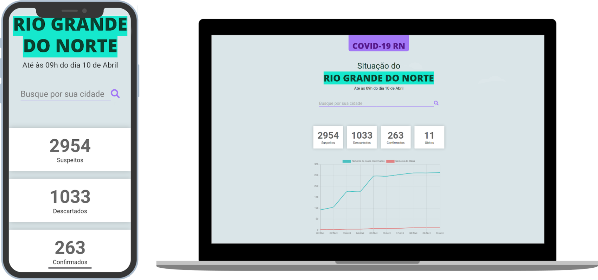

<p align="center">
    
</p>
    <h1 align="center">COVID-RN</h1>

<h4 align="center">
  🔎🦠 Rastreador de casos de coronavirus do Rio Grande do Norte em tempo real
</h4>
<p align="center">
  

  
  
  <a href="https://github.com/KZTN/COVID-RN/commits/master">
    
  </a>

  <a href="https://github.com/KZTN/COVID-RN/issues">
    
  </a>

  
</p>
<p align="center">
  
</p>

## 👋 Hello world 
[English README version](README-US.md)🇺🇸

## ⚠️ Atenção

<b>🔥 Um novo console de status do servidor da API e contagem de requisiçõoes de chamadas está sendo projetado, o período previsto de desenvolvimento e implementação é até o final do mês. Confira o <a href="#Workflow">Workflow</a>.</b>

<b>🔥 Uma nova API foi desenvolvida e está pronta para uso, confira a <a href="#-Documentação">Documentação</a>.</b>
> Recomenda-se para novos usuários o uso da V2. Pois a V1, embora continue a receber dados diários, não terá mais suporte a novas atualizações.
<br/>

> Requisições por datas específicas foram implementadas e estão liberadas para uso e consulta, a documentação referente também foi atualizada.

> As documentações foram unificadas, veja a <a href="#-Documentação">Documentação</a>


## 💻 Projeto

O COVID-RN é um projeto que visa rastrear os casos de coronavirus em todo o território do Rio Grande do Norte, informando dados únicos tanto para o estado quando para cada cidade.

## 🤔 Motivo/features

Pela falta do estado não possuir uma API sobre a incidência de casos de coronavirus e pouca dinâmica na veiculação dos boletins. O projeto tem o âmbito de oferecer:
<ul>
   <li>Uma base de dados do tipo API REST de livre acesso para pesquisa e consulta</li>
    <li>Uma interface que disponibiliza os dados gerados para o cliente</li>
    <li>Gráficos e mapas com foco nos casos no RN</li>
</ul>

## 🔖 Layout

Com base no design dos boletins epidemiológicos lançados pela SESAP-RN, o projeto seguiu o mesmo modelo como base da estrutura dos dados. Ganhando posteiormente responsividade para diferentes telas, garantindo acesisiblidade a diferentes tipos de usuários com seus respectivos dispositivos desktop 💻 e mobile 📱.

## 💽 Fonte de dados 

- [Secretaria de Saúde Pública do Rio Grande do Norte](http://www.saude.rn.gov.br/)

## 🔌 Base url 

Todas chamadas devem usar a url base:
```
https://covid-rn-server.herokuapp.com/api/v2
```
> utilize a [documentação](https://insomnia-documenter-covidrn-6fgddqztj.now.sh/) para mais informações de como utilizar a API corretamente


## Começando...
Essas instruções fornecerão uma cópia do projeto em execução na sua máquina local para fins de desenvolvimento e teste.

### Pré-requisitos
O que você precisa para instalar o software:

```
node v12.x
yarn 1.22.4
npm 6.14.4
git
```
> Para uma melhor experiência no ambiente de testes com o servidor API REST, recomenda-se o uso do [insomnia](https://insomnia.rest/)

### Instalando o projeto 🚀
Clonando o projeto:

```
git clone https://github.com/KZTN/COVID-RN.git
```

Navegando até a pasta do projeto:

```
cd COVID-RN
```

Crie um arquivo `.env` na raíz do projeto e adicione as seguintes linhas:

```bash
REACT_APP_GOOGLE_KEY= YOUR_GOOGLE_API_HERE
REACT_APP_API_URL= https://covid-rn-server.herokuapp.com/api/v2
```
> Para obter sua própria API da google, acesse: https://console.cloud.google.com/ (Recurso não obrigatório)

Baixando as dependências do projeto:

```bash
yarn install
```

Rodando o projeto:

```bash
yarn start
```


Visite http://localhost:3000 com o seu navegador para ver o resultado. 🎉

## 📄 Documentação 

<a href="https://covid-rn-documentation.now.sh/" target="_blank">Versão unificada</a>


## Como contribuir

- Faça um fork desse repositório;
- Cria uma branch com a sua feature: `git checkout -b minha-feature`;
- Faça commit das suas alterações: `git commit -m 'feat: Minha nova feature'`;
- Faça push para a sua branch: `git push origin minha-feature`.

Depois que o merge da sua pull request for feito, você pode deletar a sua branch.

## Workflow

- [x] Criar uma base de dados API REST
- [x] Criar uma aplicação web para o projeto
- [x] Integração frontend com backend
- [x] Criar interface responsiva
- [x] Elaborar gráficos com base de dados
- [x] Elaborar mapas com base de dados
- [x] Deploy da aplicação
- [x] Desenvolver a versão 2.0 da API
- [x] Consultas a API por data específica
- [ ] Elaborar um modelo epidemiológico SIR no projeto (em desenvolvimento...)
- [ ] Gerar estatísticas de acesso, consultas, erros e depuração (em desenvolvimento...)
- [ ] Criar um console de consultas à API e estátisticas de acesso
- [x] Gerar relatórios automáticos de status do serviço
- [x] Gerar mapas de contaminação por data
- [ ] Revisão, refatoração e optimização de todo o projeto (em desenvolvimento...)
- [x] Elaborar gráficos com base no índice de isolamento social
- [x] Dicionário de buscas de cidades, melhorias de usabilidade, melhorias de navegação de mapa

- [ ] and more...

## :memo: Licença

Esse projeto está sob a licença MIT. Veja o arquivo [LICENSE](LICENSE.md) para mais detalhes.

## 🤝 Ajude o projeto 

<a href="https://opencollective.com/covid-rn/donate" target="_blank">
  
</a>


## Autores

<table align="center">
  <tr >
    <td align="center"><a href="https://github.com/KZTN"><br /><sub><b>Kaio César</b></sub></a><br /><a href="https://github.com/kztn/COVID-RN/commits?author=kztn" title="Code">💻</a> <a href="#kztn" title="Design">🎨</a></td>
  <tr>
</table>

## 

<p align="center">Feito com ♥ by KZTN</p>
